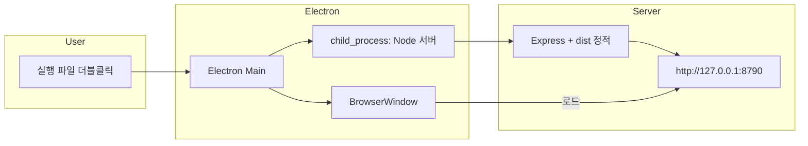

# Windows 설치형 패키징 가이드

> 최종 갱신: 2026-02-26 | 버전: v1.1.9

HyperClaw를 Windows에서 **설치형 실행 파일**로 배포하여, 설치 후 크롬처럼 시작 메뉴/바탕화면의 실행 파일로 앱을 실행할 수 있도록 하는 방안을 정리한 문서입니다.

---

## 1. 목적 및 범위

### 1.1 목적

- **요구사항**: 설치 시 실행 파일이 생성되고, 더블클릭으로 현재 프로젝트(HyperClaw)가 실행되도록 함.
- **사용자 경험**: 설치 후 시작 메뉴 또는 바탕화면 바로가기로 단일 앱 창이 열리고, 별도 브라우저/Node 설치 없이 동작.

### 1.2 범위

- **플랫폼**: Windows 전용 (설치 exe 또는 portable).
- **배포 형태**: 단일 exe, 또는 설치 폴더 + 바로가기. NSIS/MSI 등 설치 프로그램 생성 포함.

---

## 2. 아키텍처 옵션

Windows에서 “실행 파일 하나로 앱 실행”을 구현하는 대표적인 두 가지 방식을 비교합니다.

| 옵션 | 설명 | 장점 | 단점 |
|------|------|------|------|
| **A. Electron** | Electron 메인 프로세스에서 Express를 child_process로 기동하고, BrowserWindow에서 `http://127.0.0.1:8790` 로드 | 단일 창 앱, 크롬과 유사한 UX, electron-builder로 NSIS/MSI 설치 프로그램 생성 용이 | 번들 크기 증가, Electron 의존성 |
| **B. 런처 + 시스템 브라우저** | 작은 런처 exe가 서버 기동 후 기본 브라우저로 `http://127.0.0.1:8790` 오픈 | 구현 단순, 번들 크기 작음 | 앱이 브라우저 탭으로 열림(단일 앱 창 아님) |

**권장: 옵션 A (Electron)** — “크롬처럼” 단일 실행 파일·단일 앱 창을 만드는 경우 Electron + electron-builder 조합을 권장합니다.

---

## 3. 권장 방식: Electron + electron-builder

### 3.1 전체 흐름



1. 사용자가 설치된 실행 파일(또는 바로가기)을 실행.
2. Electron 메인 프로세스가 기동.
3. 메인 프로세스가 **child_process**로 현재 Node 기반 Express 서버를 실행(번들된 서버 + `dist/` 사용).
4. 서버가 `127.0.0.1:8790`에서 리스닝하는 것을 확인한 뒤, **BrowserWindow**에서 `http://127.0.0.1:8790` 로드.
5. 창 종료 시 서버 자식 프로세스 종료.

### 3.2 디렉터리/역할

| 구성 요소 | 역할 |
|-----------|------|
| **Electron main** | 진입점(예: `electron/main.js`). 서버 기동, 리스닝 대기, BrowserWindow 생성·관리, 종료 시 서버 프로세스 kill. |
| **server/** | 기존 Express 앱. 패키징 시 Node 런타임(또는 번들)으로 child_process에서 실행. |
| **dist/** | `pnpm build`로 생성된 프론트엔드 정적 파일. 프로덕션 모드에서 서버가 이 경로를 서빙하므로, Electron 리소스(또는 asar) 내에 포함. |

프로덕션에서는 이미 단일 포트(8790)에서 API + 정적 UI를 서빙하므로, Electron은 “서버 기동 + 창에서 해당 URL 로드”만 담당하면 됩니다.

---

## 4. 빌드 및 패키징 단계

### 4.1 사전 조건

- **Node.js**: >= 22 (프로젝트 요구사항과 동일).
- **패키지 매니저**: pnpm.
- **프론트 빌드**: `pnpm build`로 `dist/` 생성 필수.

### 4.2 electron-builder 설정 요약

- **도구**: [electron-builder](https://www.electron.build/) 사용.
- **package.json**에 `build` 필드 추가 예시:

```json
{
  "main": "electron/main.js",
  "scripts": {
    "build": "tsc -b && vite build",
    "dist:win": "electron-builder --win"
  },
  "build": {
    "appId": "com.hyperclaw.app",
    "productName": "HyperClaw",
    "directories": {
      "output": "release"
    },
    "files": ["dist/**", "server/**", "electron/**", "node_modules/**"],
    "win": {
      "target": ["nsis", "portable"],
      "icon": "build/icon.ico"
    },
    "nsis": {
      "oneClick": false,
      "allowToChangeInstallationDirectory": true,
      "createDesktopShortcut": true,
      "createStartMenuShortcut": true
    }
  }
}
```

- **Windows 타깃**: `nsis`(설치 프로그램), `portable`(단일 exe 포터블) 등 필요에 따라 선택.

### 4.3 Node 번들(설치 PC에 Node 불필요)

- Windows 설치본에서 서버를 실행하려면 **Node 런타임**이 필요합니다. 프로젝트는 Node를 설치본에 함께 넣어 두어, 사용자 PC에 Node를 설치하지 않아도 되도록 합니다.
- **최초 1회**: `pnpm run download-node` 실행 → Node 22 Windows x64를 `build/node/`에 받습니다.
- 이후 `pnpm run dist:win` 시 `build/node`가 `resources/node/`로 복사되어 exe와 함께 배포됩니다.

### 4.4 생성 결과물

| 타깃 | 결과물 |
|------|--------|
| **nsis** | `release-new/HyperClaw Setup x.x.x.exe` — 설치 시 시작 메뉴/바탕화면 바로가기 생성. |
| **portable** | `release-new/HyperClaw x.x.x.exe` — 설치 없이 실행 가능한 단일 exe. |
| **win-unpacked** | `release-new/win-unpacked/` — exe 및 resources(app, node) 폴더. 로그는 `win-unpacked/logs/electron-main.log`. |

---

## 5. 설치형 실행 시 주의사항

### 5.1 DB 및 데이터 경로

- 현재 서버는 **`process.cwd()`** 기준으로 `hyperclaw.sqlite`를 사용합니다(`server/config/runtime.ts`의 `DEFAULT_DB_PATH`).
- **설치형**에서는 `process.cwd()`가 실행 파일/설치 디렉터리가 되도록 하거나, Electron의 `app.getPath('userData')` 등으로 DB·설정 경로를 고정하는 것이 좋습니다.
- 패키징 시 서버를 child_process로 기동할 때 **cwd**를 `userData` 또는 설치 경로의 resources로 두고, 서버 쪽에서 해당 cwd를 기준으로 DB 경로를 해석하도록 환경 변수 또는 런타임 검사 추가를 권장합니다.

### 5.2 DIST_DIR

- 패키징 시 `dist`는 Electron **resources**(또는 asar) 내에 포함됩니다.
- 서버의 `DIST_DIR`은 현재 `server` 디렉터리 기준 상대 경로로 계산되므로, **Electron 리소스 경로**를 가리키도록 환경 변수(예: `HYPERCLAW_DIST`) 또는 런타임에서의 경로 검사가 필요할 수 있습니다.

### 5.3 .env

- **패키징에 `.env` 포함**: 키/비밀 정보가 없는 경우 `.env`를 설치본에 포함해 두었습니다(`package.json` → `build.files`). 서버는 앱 루트의 `.env`를 로드합니다.
- 비밀 키가 필요한 항목(`OAUTH_ENCRYPTION_SECRET` 등)은 배포용 `.env`에 넣지 말고, **기본값/자동 생성** 또는 **첫 실행 시 설정 UI**로 처리하는 것을 권장합니다.

### 5.4 Node 버전 및 호환성

- 프로젝트는 **Node >= 22**를 요구합니다. Electron이 내장하는 Node 버전과 Express, `ws`, `node:sqlite` 등 사용 모듈의 호환성을 빌드·실행 단계에서 확인하는 것이 좋습니다.

### 5.5 방화벽 및 바인딩

- 서버는 **127.0.0.1**에만 바인딩하므로 외부 노출이 없습니다. 방화벽 경고가 나오는 경우 “localhost 전용”으로 설명할 수 있습니다.

---

## 6. 향후 작업

### 6.1 최소 코드 변경 범위

- **Electron 진입점**: `electron/main.js`(또는 TypeScript로 작성 후 빌드). 서버를 child_process로 띄우고, 리스닝 확인 후 BrowserWindow 로드, 앱 종료 시 서버 프로세스 종료.
- **서버 기동 스크립트**: 패키징된 환경에서 사용할 실행 스크립트(예: `node server/index.js` 또는 번들된 서버 진입점). cwd·환경 변수(DIST_DIR, DB 경로 등) 전달 포함.

### 6.2 선택적 확장

- **pkg / nexe**: 서버를 단일 Node 바이너리로 묶어 child_process에서 실행하면, 사용자 PC에 Node를 설치하지 않아도 됩니다. 문서 단계에서는 “기본은 Electron에서 child_process로 현재 Node 서버 실행”으로 두고, 필요 시 pkg/nexe 도입을 검토할 수 있습니다.
- **자동 업데이트**: electron-builder와 연동한 auto-updater(예: electron-updater) 도입 시 설치형 배포의 업데이트 경로를 문서에 추가할 수 있습니다.

---

## 참고

- 프로덕션 동작: [server/config/runtime.ts](../../server/config/runtime.ts) — `IS_PRODUCTION`, `DIST_DIR`, `DEFAULT_DB_PATH`
- 정적 서빙: [server/modules/lifecycle.ts](../../server/modules/lifecycle.ts), [server/middleware/static.ts](../../server/middleware/static.ts)
- 기술 스택: [기술스택.md](기술스택.md)
